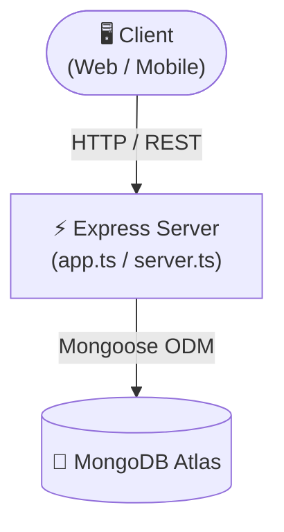
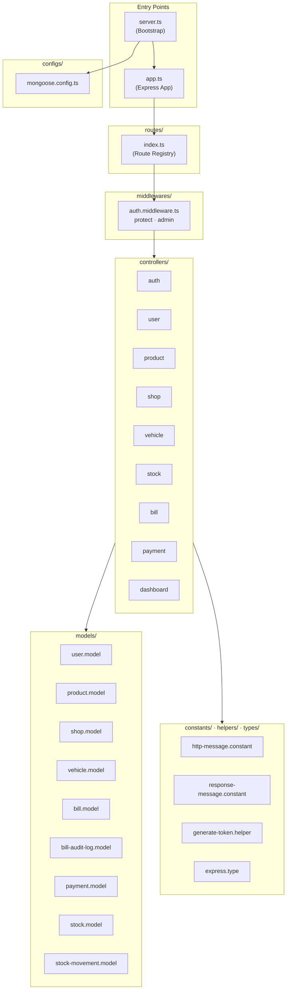
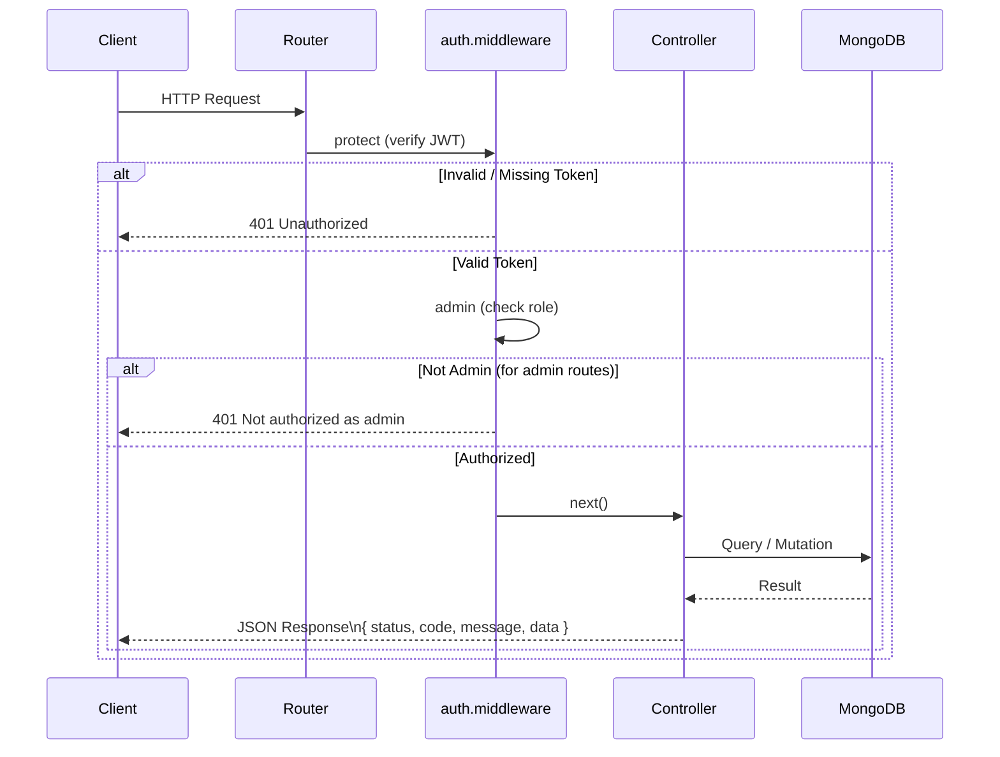
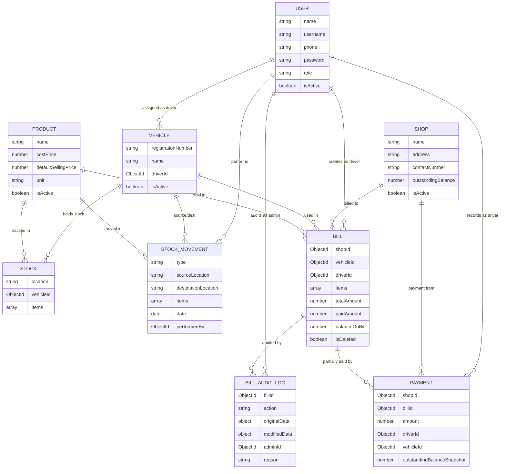
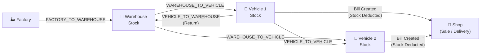

# MP Backend — Architecture Diagram

## System Overview

```mermaid
graph TB
    Client(["🖥️ Client\n(Web / Mobile)"])
    Server["⚡ Express Server\n(app.ts / server.ts)"]
    DB[("🍃 MongoDB Atlas")]

    Client -->|"HTTP / REST"| Server
    Server -->|"Mongoose ODM"| DB
```

---

## Layered Architecture

```mermaid
graph TB
    subgraph Entry["Entry Points"]
        S["server.ts\n(Bootstrap)"]
        A["app.ts\n(Express App)"]
    end

    subgraph Config["configs/"]
        MC["mongoose.config.ts"]
    end

    subgraph Routes["routes/"]
        RI["index.ts\n(Route Registry)"]
    end

    subgraph Middlewares["middlewares/"]
        AM["auth.middleware.ts\nprotect · admin"]
    end

    subgraph Controllers["controllers/"]
        direction LR
        AC["auth"]
        UC["user"]
        PC["product"]
        SC["shop"]
        VC["vehicle"]
        STK["stock"]
        BC["bill"]
        PAY["payment"]
        DC["dashboard"]
    end

    subgraph Models["models/"]
        direction LR
        UM["user.model"]
        PM["product.model"]
        SM["shop.model"]
        VM["vehicle.model"]
        BM["bill.model"]
        BAL["bill-audit-log.model"]
        PAM["payment.model"]
        STM["stock.model"]
        SMM["stock-movement.model"]
    end

    subgraph Support["constants/ · helpers/ · types/"]
        HMC["http-message.constant"]
        RMC["response-message.constant"]
        GTH["generate-token.helper"]
        ET["express.type"]
    end

    S --> MC
    S --> A
    A --> RI
    RI --> AM
    AM --> Controllers
    Controllers --> Models
    Controllers --> Support
```

---

## API Route Map

```mermaid
graph LR
    API["/api"] --> U["/users"]
    API --> P["/products"]
    API --> SH["/shops"]
    API --> V["/vehicles"]
    API --> ST["/stock"]
    API --> B["/bills"]
    API --> PAY["/payments"]
    API --> D["/dashboard"]

    U --> U1["POST /login\n🔓 Public"]
    U --> U2["GET  /profile\n🔐 Auth"]
    U --> U3["POST /\n🛡️ Admin"]
    U --> U4["GET  /\n🛡️ Admin"]
    U --> U5["PUT  /:id\n🛡️ Admin"]
    U --> U6["DELETE /:id\n🛡️ Admin"]

    P --> P1["GET  /\n🔐 Auth"]
    P --> P2["POST /\n🛡️ Admin"]
    P --> P3["PUT  /:id\n🛡️ Admin"]
    P --> P4["DELETE /:id\n🛡️ Admin"]

    SH --> SH1["GET  /\n🔐 Auth"]
    SH --> SH2["POST /\n🛡️ Admin"]
    SH --> SH3["GET  /:id\n🔐 Auth"]
    SH --> SH4["PUT  /:id\n🛡️ Admin"]
    SH --> SH5["DELETE /:id\n🛡️ Admin"]
    SH --> SH6["GET  /:id/history\n🛡️ Admin"]

    V --> V1["GET  /\n🔐 Auth"]
    V --> V2["POST /\n🛡️ Admin"]
    V --> V3["PUT  /:id\n🛡️ Admin"]
    V --> V4["DELETE /:id\n🛡️ Admin"]
    V --> V5["PUT  /:id/assign\n🛡️ Admin"]

    ST --> ST1["GET  /\n🔐 Auth"]
    ST --> ST2["POST /transfer\n🛡️ Admin"]

    B --> B1["POST /\n🔐 Driver"]
    B --> B2["GET  /\n🔐 Auth"]
    B --> B3["GET  /:id\n🔐 Auth"]
    B --> B4["PUT  /:id\n🛡️ Admin"]
    B --> B5["DELETE /:id\n🛡️ Admin"]
    B --> B6["GET  /:id/audit\n🛡️ Admin"]

    PAY --> PAY1["POST /\n🔐 Driver"]
    PAY --> PAY2["GET  /\n🔐 Auth"]

    D --> D1["GET /stats\n🛡️ Admin"]
    D --> D2["GET /profit\n🛡️ Admin"]
    D --> D3["GET /reports\n🛡️ Admin"]
    D --> D4["GET /vehicle-history/:id\n🛡️ Admin"]
```

---

## Request Flow

```mermaid
sequenceDiagram
    participant C as Client
    participant R as Router
    participant M as auth.middleware
    participant Ctrl as Controller
    participant DB as MongoDB

    C->>R: HTTP Request
    R->>M: protect (verify JWT)
    alt Invalid / Missing Token
        M-->>C: 401 Unauthorized
    else Valid Token
        M->>M: admin (check role)
        alt Not Admin (for admin routes)
            M-->>C: 401 Not authorized as admin
        else Authorized
            M->>Ctrl: next()
            Ctrl->>DB: Query / Mutation
            DB-->>Ctrl: Result
            Ctrl-->>C: JSON Response\n{ status, code, message, data }
        end
    end
```

---

## Data Model Relationships

```mermaid
erDiagram
    USER {
        string name
        string username
        string phone
        string password
        string role
        boolean isActive
    }

    VEHICLE {
        string registrationNumber
        string name
        ObjectId driverId
        boolean isActive
    }

    PRODUCT {
        string name
        number costPrice
        number defaultSellingPrice
        string unit
        boolean isActive
    }

    SHOP {
        string name
        string address
        string contactNumber
        number outstandingBalance
        boolean isActive
    }

    STOCK {
        string location
        ObjectId vehicleId
        array items
    }

    STOCK_MOVEMENT {
        string type
        string sourceLocation
        string destinationLocation
        array items
        date date
        ObjectId performedBy
    }

    BILL {
        ObjectId shopId
        ObjectId vehicleId
        ObjectId driverId
        array items
        number totalAmount
        number paidAmount
        number balanceOnBill
        boolean isDeleted
    }

    BILL_AUDIT_LOG {
        ObjectId billId
        string action
        object originalData
        object modifiedData
        ObjectId adminId
        string reason
    }

    PAYMENT {
        ObjectId shopId
        ObjectId billId
        number amount
        ObjectId driverId
        ObjectId vehicleId
        number outstandingBalanceSnapshot
    }

    USER ||--o{ VEHICLE : "assigned as driver"
    USER ||--o{ BILL : "creates as driver"
    USER ||--o{ PAYMENT : "records as driver"
    USER ||--o{ STOCK_MOVEMENT : "performs"
    USER ||--o{ BILL_AUDIT_LOG : "audits as admin"

    SHOP ||--o{ BILL : "billed to"
    SHOP ||--o{ PAYMENT : "payment from"

    VEHICLE ||--o{ STOCK : "holds stock"
    VEHICLE ||--o{ BILL : "used in"
    VEHICLE ||--o{ STOCK_MOVEMENT : "source/dest"

    PRODUCT ||--o{ STOCK : "tracked in"
    PRODUCT ||--o{ BILL : "sold in"
    PRODUCT ||--o{ STOCK_MOVEMENT : "moved in"

    BILL ||--o{ BILL_AUDIT_LOG : "audited by"
    BILL ||--o{ PAYMENT : "partially paid by"
```

---

## Stock Flow

```mermaid
flowchart LR
    F["🏭 Factory"]
    W["🏢 Warehouse\nStock"]
    V1["🚚 Vehicle 1\nStock"]
    V2["🚚 Vehicle 2\nStock"]
    SH1["🏪 Shop\n(Sale / Delivery)"]

    F -->|"FACTORY_TO_WAREHOUSE"| W
    W -->|"WAREHOUSE_TO_VEHICLE"| V1
    W -->|"WAREHOUSE_TO_VEHICLE"| V2
    V1 -->|"VEHICLE_TO_VEHICLE"| V2
    V1 -->|"VEHICLE_TO_WAREHOUSE\n(Return)"| W
    V1 -->|"Bill Created\n(Stock Deducted)"| SH1
    V2 -->|"Bill Created\n(Stock Deducted)"| SH1
```
